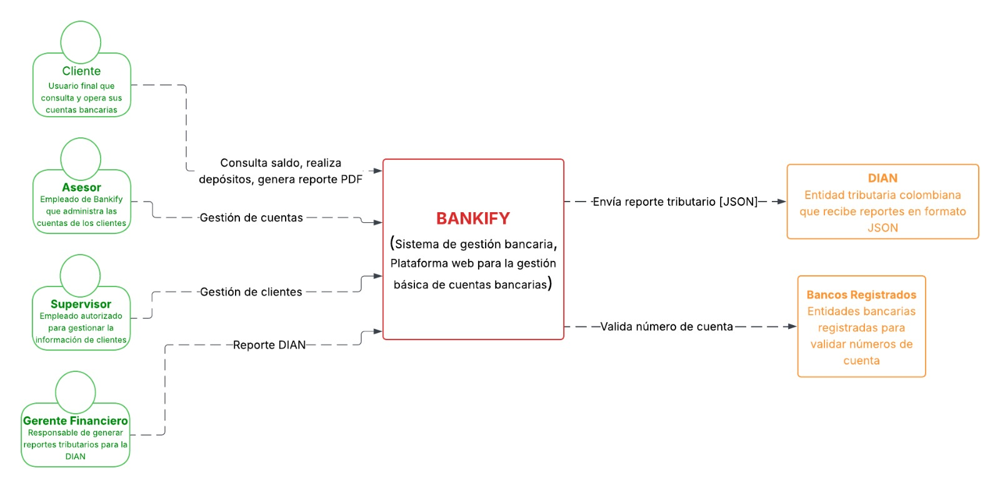
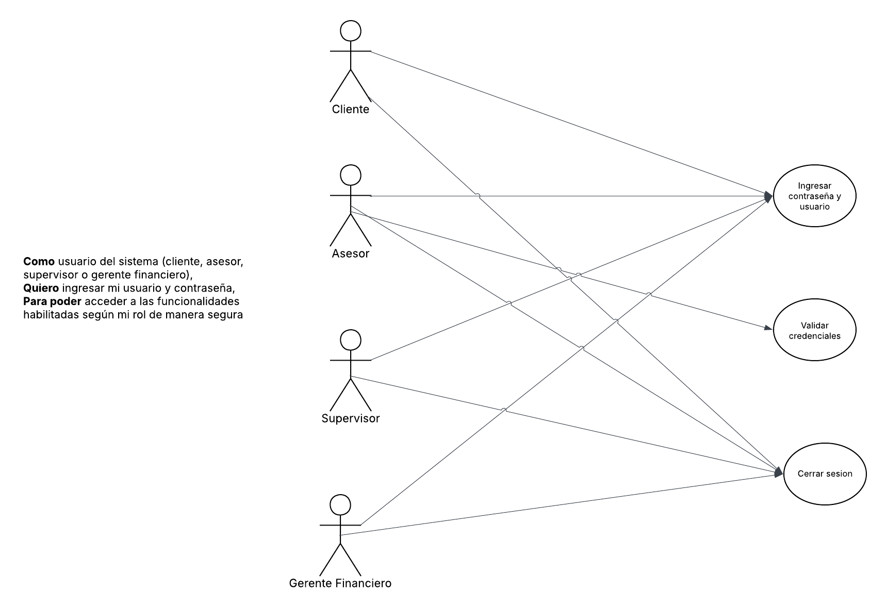
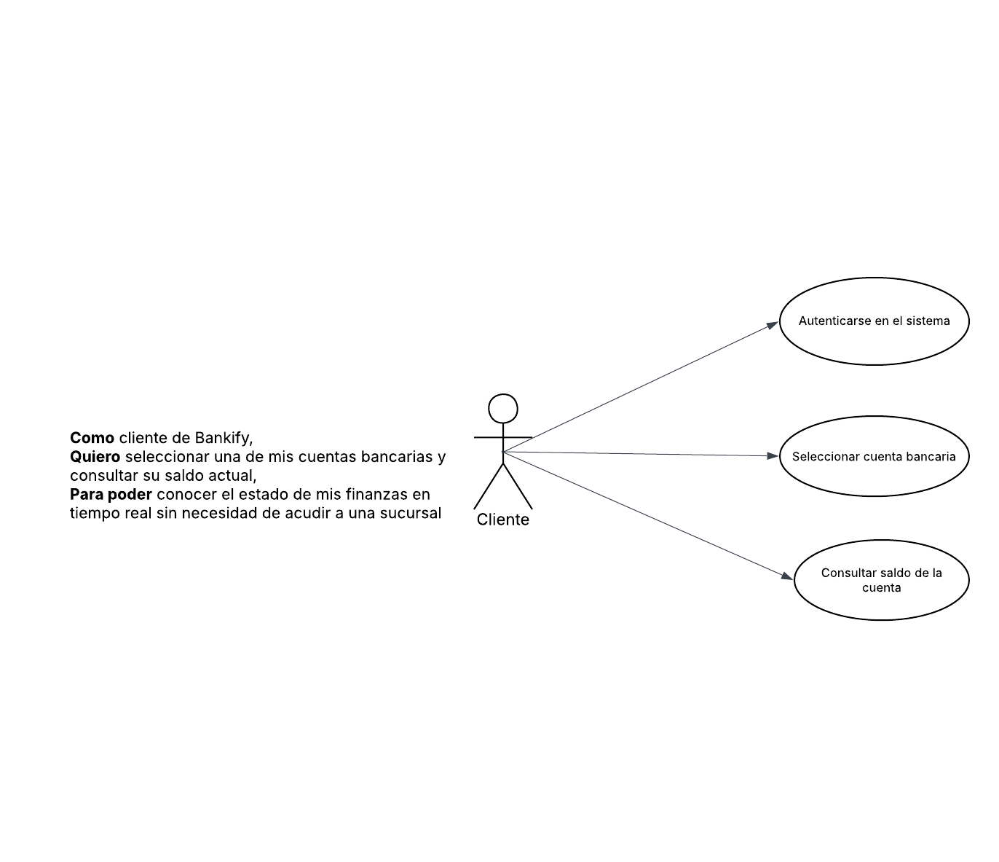
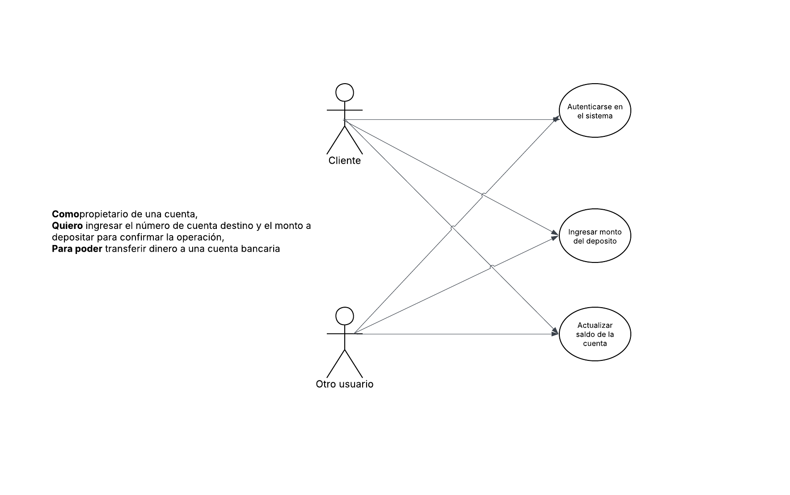
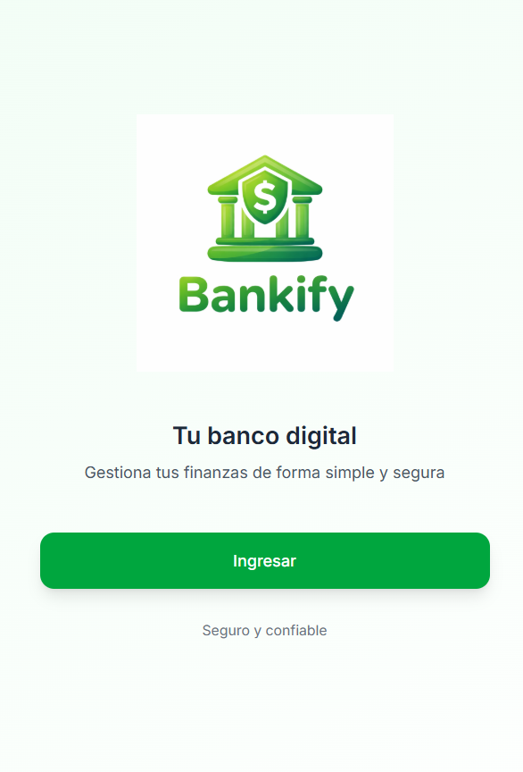
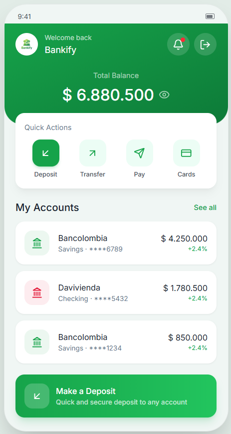
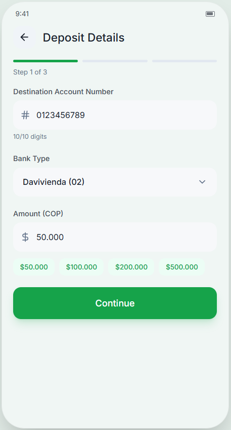
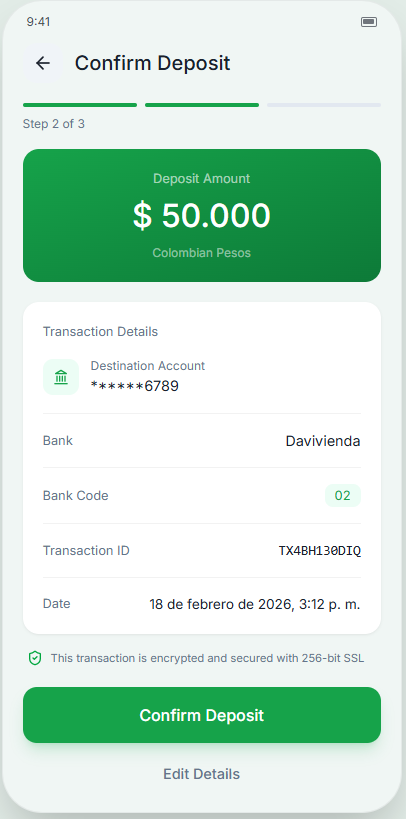
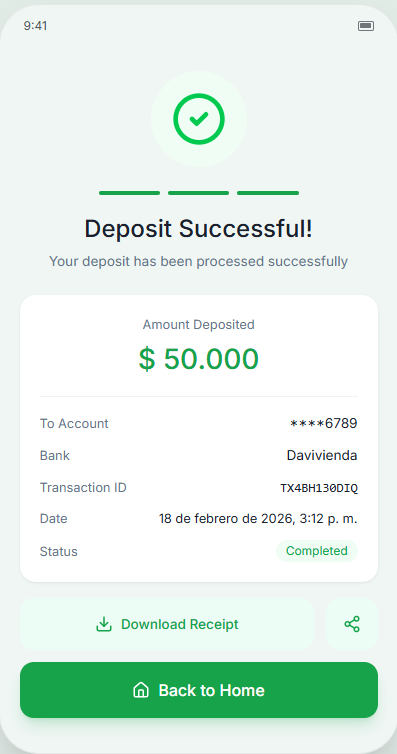

# DOSW Laboratorio 4 – Bankify

## **Semestre:** 2026-1

---

## **Integrantes del Equipo**

| **Integrante** | **GitHub** | **Contacto** |
|---|---|---|
| **Maria Juliana Rodriguez Caicedo** | [@JuliRodC](https://github.com/JuliRodC) | [maria.rodriguez@mail.escuelaing.edu.co](mailto:maria.rodriguez@mail.escuelaing.edu.co) |
| **Kevyn Daniel Forero Gonzalez** | [@kevyn1005](https://github.com/kevyn1005) | [kevyn.forero@mail.escuelaing.edu.co](mailto:kevyn.forero@mail.escuelaing.edu.co) |
| **Diego Alejandro Montes Bonilla** | [@banettchi](https://github.com/banettchi) | [diego.montes@mail.escuelaing.edu.co](mailto:diego.montes@mail.escuelaing.edu.co) |

---

## **Caso de Estudio: Bankify**

Bankify es una startup fintech que está desarrollando un sistema para la gestión básica de cuentas bancarias. En esta primera versión, se busca validar el modelo de negocio implementando únicamente funcionalidades esenciales: registro de cuentas, consulta de saldo, depósitos, y generación de reportes tributarios.

---

## **Estructura del Proyecto**

```
DOSW-Laboratorio4/
├── pom.xml
├── README.md
├── docs/
│   ├── Images/                  ← Mockups y diagrama de contexto
│   │   ├── Dia_Contexto.png
│   │   ├── Mockup1.png
│   │   ├── Mockup2.png
│   │   ├── Mockup3.png
│   │   ├── Mockup4.png
│   │   └── Mockup5.png
│   ├── uml/                     ← Diagramas de caso de uso
│   │   ├── DiagramaR1.png
│   │   ├── DiagramaR4.png
│   │   └── DiagramaR5.png
│   └── requirements/            ← Documentación de requerimientos
│       ├── scope.md
│       └── requirements.md
└── src/
    ├── main/java/edu/dosw/lab/
    │   └── App.java
    └── test/java/edu/dosw/lab/
        └── AppTest.java
```

---

## **Compilación y Ejecución**

**Compilar:**
```bash
mvn clean compile
```

**Ejecutar pruebas:**
```bash
mvn test
```

---

## **Parte 1 – Estructura del Proyecto**

### Preguntas Teóricas

#### a. ¿Qué es un arquetipo (Archetype) en Maven?

Un arquetipo en Maven es una plantilla o modelo de proyecto que define una estructura de directorios estándar, archivos de configuración iniciales y dependencias básicas. Los arquetipos permiten generar rápidamente la estructura base de un proyecto siguiendo las convenciones y mejores prácticas de Maven, evitando que el desarrollador tenga que crear manualmente todos los archivos y carpetas necesarios. En esencia, un arquetipo es un patrón o prototipo a partir del cual se crean nuevos proyectos (Apache Maven Project, s.f.).

#### b. ¿Para qué sirve el arquetipo maven-archetype-quickstart?

El arquetipo `maven-archetype-quickstart` sirve para generar un proyecto Java básico con la estructura estándar de Maven. Al utilizarlo, se crea automáticamente:

- Un archivo `pom.xml` con la configuración básica del proyecto.
- Un directorio `src/main/java` con una clase principal de ejemplo (`App.java`).
- Un directorio `src/test/java` con una clase de prueba unitaria de ejemplo (`AppTest.java`).

Este arquetipo es ideal para iniciar rápidamente un proyecto Java simple, ya que proporciona la estructura mínima necesaria para compilar, ejecutar pruebas y empaquetar el proyecto (Apache Maven Project, s.f.).

#### c. ¿Cuál es el comando con el cual se puede crear un proyecto basado en un arquetipo Maven?

El comando para crear un proyecto basado en un arquetipo Maven es:

```bash
mvn archetype:generate -DgroupId=<groupId> -DartifactId=<artifactId> -DarchetypeArtifactId=<archetype> -DinteractiveMode=false
```

Donde:
- `-DgroupId`: Identificador del grupo o la organización.
- `-DartifactId`: Nombre del proyecto o artefacto.
- `-DarchetypeArtifactId`: Nombre del arquetipo a utilizar.
- `-DinteractiveMode=false`: Desactiva el modo interactivo.

#### d. ¿Qué es un pull request en GitHub?

Un pull request (PR) en GitHub es una solicitud formal para integrar los cambios realizados en una rama de un repositorio a otra rama (generalmente a `develop` o `main`). Permite a los miembros del equipo revisar el código propuesto, agregar comentarios, solicitar cambios o aprobar las modificaciones antes de que se fusionen (GitHub Docs, s.f.).

#### e. ¿Cómo se crea un pull request en GitHub?

1. Realizar un push de la rama con los cambios al repositorio remoto.
2. Ir al repositorio en GitHub y hacer clic en la pestaña **"Pull requests"**.
3. Hacer clic en **"New pull request"**.
4. Seleccionar la **rama base** (destino) y la **rama de comparación** (con los cambios).
5. Agregar un **título** descriptivo y una **descripción** detallada.
6. Hacer clic en **"Create pull request"**.

#### f. ¿Cómo se aprueba un pull request en GitHub?

1. Ir a la pestaña **"Pull requests"** y seleccionar el PR a revisar.
2. Revisar los cambios en la pestaña **"Files changed"**.
3. Hacer clic en **"Review changes"** → seleccionar **"Approve"**.
4. Hacer clic en **"Submit review"**.
5. Una vez aprobado, hacer clic en **"Merge pull request"**.

#### g. Bibliografía

- Apache Maven Project. (s.f.). *Introduction to Archetypes*. Maven. Recuperado el 18 de febrero de 2026, de https://maven.apache.org/guides/introduction/introduction-to-archetypes.html
- Apache Maven Project. (s.f.). *Maven Archetype Plugin – archetype:generate*. Maven. Recuperado el 18 de febrero de 2026, de https://maven.apache.org/archetype/maven-archetype-plugin/generate-mojo.html
- GitHub Docs. (s.f.). *About pull requests*. GitHub. Recuperado el 18 de febrero de 2026, de https://docs.github.com/en/pull-requests/collaborating-with-pull-requests/proposing-changes-to-your-work-with-pull-requests/about-pull-requests
- GitHub Docs. (s.f.). *Creating a pull request*. GitHub. Recuperado el 18 de febrero de 2026, de https://docs.github.com/en/pull-requests/collaborating-with-pull-requests/proposing-changes-to-your-work-with-pull-requests/creating-a-pull-request

### Comando ejecutado para crear la estructura del proyecto

```bash
mvn archetype:generate -DgroupId=edu.dosw.lab -DartifactId=DOSW-Laboratorio4 -DarchetypeArtifactId=maven-archetype-quickstart -DarchetypeVersion=1.5 -DinteractiveMode=false
```

---

## **Parte 2 – Diagrama de Contexto**

El diagrama de contexto describe el sistema Bankify, sus actores y los sistemas externos con los que interactúa.

### Diagrama de Contexto



### Actores del Sistema

| Actor / Rol | Descripción |
|---|---|
| **Cliente** | Consulta saldos, realiza depósitos y genera reportes PDF de su declaración de renta |
| **Asesor** | Crea, activa, inactiva y actualiza cuentas bancarias |
| **Supervisor** | Crea, activa, inactiva, actualiza y elimina clientes del sistema |
| **Gerente Financiero** | Genera y envía reportes tributarios de todas las cuentas a la DIAN |

### Sistemas Externos

| Sistema | Descripción |
|---|---|
| **DIAN** | Entidad tributaria colombiana que recibe reportes de declaración de renta en formato JSON |
| **Bancos Registrados** | Entidades bancarias (ej. Bancolombia `01`, Davivienda `02`) usadas para validar los dos primeros dígitos del número de cuenta |

### Alcance del Sistema

**Dentro del sistema:**
1. Autenticación de usuarios mediante usuario y contraseña.
2. Gestión de clientes: creación, activación, inactivación, actualización y eliminación por parte del supervisor.
3. Gestión de cuentas bancarias: creación, activación, inactivación y actualización según el rol del usuario.
4. Consulta de saldo de cuentas por parte del cliente.
5. Realización de depósitos a cuentas bancarias.
6. Generación de reporte tributario en formato PDF para el cliente.
7. Generación y envío de reportes tributarios a la DIAN en formato JSON por parte del gerente financiero.
8. Validación de números de cuenta: exactamente 10 dígitos numéricos y pertenecientes a un banco registrado.

**Fuera del sistema:**
1. Procesamiento de pagos a terceros o transferencias entre bancos externos.
2. Gestión de productos financieros complejos como créditos, inversiones o seguros.
3. Integración directa con los sistemas internos de los bancos para sincronización de saldos en tiempo real.
4. Soporte para múltiples monedas o transacciones en divisas extranjeras.

---

## **Parte 3 – Definición y Análisis de Requerimientos**

### Requerimientos Funcionales

| ID | Nombre | Rol |
|---|---|---|
| RF-01 | Autenticación de Usuarios | Cliente, Asesor, Supervisor, Gerente Financiero |
| RF-02 | Gestión de Clientes | Supervisor |
| RF-03 | Gestión de Cuentas Bancarias | Asesor, Cliente (inactivar) |
| RF-04 | Consulta de Saldo | Cliente |
| RF-05 | Realizar Depósito | Cliente propietario, Otro usuario autenticado |
| RF-06 | Generar Reporte PDF | Cliente |
| RF-07 | Generar y Enviar Reporte DIAN (JSON) | Gerente Financiero |

### Requerimientos No Funcionales

| ID | Categoría | Descripción |
|---|---|---|
| RNF-01 | Seguridad | Las contraseñas deben almacenarse cifradas con hash seguro (bcrypt o similar) |
| RNF-02 | Disponibilidad | El sistema debe estar disponible mínimo el 99% del tiempo en horario laboral |
| RNF-03 | Rendimiento | Las consultas de saldo y depósitos deben responder en menos de 2 segundos |
| RNF-04 | Usabilidad | La interfaz debe permitir que un usuario sin conocimientos técnicos opere sin capacitación |
| RNF-05 | Mantenibilidad | El código debe seguir estándares definidos y tener cobertura de pruebas mínima del 70% |

---

### Casos de Uso Detallados

#### RF-01 – Autenticación de Usuarios

| Campo | Descripción |
|---|---|
| **ID** | RF-01 |
| **Nombre** | Autenticación de Usuarios |
| **Historia de usuario** | **Como** usuario del sistema, **quiero** ingresar mi usuario y contraseña, **para poder** acceder a las funcionalidades habilitadas según mi rol de manera segura. |
| **Actor** | Cliente, Asesor, Supervisor, Gerente Financiero |
| **Precondiciones** | El usuario debe estar previamente registrado con un rol asignado. |
| **Flujo principal** | 1. El actor ingresa su usuario y contraseña. <br>2. El sistema valida las credenciales. <br>3. El sistema redirige al actor al módulo correspondiente según su rol. |
| **Flujo alterno** | 2a. Si las credenciales son incorrectas, el sistema muestra un mensaje de error y solicita reingresar los datos. |
| **Poscondiciones** | El usuario queda autenticado con acceso únicamente a las funcionalidades de su rol. |

**Diagrama de Caso de Uso RF-01:**



---

#### RF-04 – Consulta de Saldo

| Campo | Descripción |
|---|---|
| **ID** | RF-04 |
| **Nombre** | Consulta de Saldo |
| **Historia de usuario** | **Como** cliente de Bankify, **quiero** seleccionar una de mis cuentas y consultar su saldo actual, **para poder** conocer el estado de mis finanzas en tiempo real. |
| **Actor** | Cliente |
| **Precondiciones** | El cliente debe estar autenticado y tener al menos una cuenta bancaria activa. |
| **Flujo principal** | 1. El cliente se autentica. <br>2. El cliente selecciona la cuenta a consultar. <br>3. El sistema valida que la cuenta esté activa y muestra el saldo disponible. |
| **Flujo alterno** | 3a. Si la cuenta está inactiva, el sistema muestra un mensaje indicando que no está disponible. |
| **Poscondiciones** | El cliente visualiza el saldo actualizado de la cuenta seleccionada. |

**Diagrama de Caso de Uso RF-04:**



---

#### RF-05 – Realizar Depósito

| Campo | Descripción |
|---|---|
| **ID** | RF-05 |
| **Nombre** | Realizar Depósito |
| **Historia de usuario** | **Como** propietario de una cuenta, **quiero** ingresar el número de cuenta destino y el monto a depositar, **para poder** transferir dinero de forma controlada y segura. |
| **Actor** | Cliente (Propietario), Otro Usuario Autenticado |
| **Precondiciones** | El usuario debe estar autenticado. La cuenta destino debe existir, estar activa y pertenecer a un banco registrado. El monto debe ser mayor a 0. |
| **Flujo principal** | 1. El actor se autentica. <br>2. El actor ingresa el número de cuenta destino. <br>3. El sistema valida que la cuenta exista y esté activa. <br>4. El actor ingresa el monto del depósito. <br>5. El sistema valida que el monto sea mayor a 0. <br>6. El actor confirma la operación. <br>7. El sistema actualiza el saldo de la cuenta destino. |
| **Flujo alterno** | 3a. Si la cuenta no existe o está inactiva, el sistema muestra un mensaje de error. <br>5a. Si el monto es igual o menor a 0, el sistema muestra un mensaje de validación. |
| **Poscondiciones** | El saldo de la cuenta destino se incrementa con el monto depositado y la operación queda registrada. |

**Diagrama de Caso de Uso RF-05:**



---

### Análisis de Requerimientos

#### ¿Identifica algún requerimiento que deba detallarse más?

Sí. El **RF-05 (Realizar Depósito)** requiere mayor detalle, especialmente en cuanto a quién puede depositar a qué cuentas, si existe un límite de monto por depósito, y si la operación debe quedar registrada con trazabilidad (fecha, hora, usuario que realizó el depósito).

#### ¿Existen requerimientos que se contradigan entre sí?

No se identifican contradicciones directas. Sin embargo, el **RF-05** genera ambigüedad: el caso de estudio indica que cualquier usuario autenticado puede depositar a cualquier cuenta, lo cual podría contradecir principios de seguridad implícitos en el **RF-01**, donde el acceso debe estar controlado por roles.

#### ¿Cuáles deberían ser los 2 requerimientos más importantes en una primera iteración?

1. **RF-01 – Autenticación**, ya que es la base de seguridad sobre la que se apoyan todas las demás funcionalidades.
2. **RF-03 – Gestión de cuentas**, ya que sin cuentas registradas no es posible ejecutar ninguna operación financiera del sistema.

#### ¿Existe algún requerimiento que no debería realizarse?

El **RF-07 (Envío de reporte a la DIAN en formato JSON)** no debería implementarse en esta primera versión del producto, ya que implica integración con un sistema externo real, lo cual añade complejidad técnica y legal innecesaria para validar el modelo de negocio en el MVP.

---

## **Parte 4 – Mockups y Flujos de Navegación**

Los mockups fueron diseñados para el requerimiento **RF-05 (Realizar Depósito)**, cubriendo el flujo completo desde el login hasta la confirmación del depósito.

### Mockup 1 – Login / Autenticación



Pantalla de inicio de sesión donde el usuario ingresa su usuario y contraseña. El sistema redirige según el rol asignado.

---

### Mockup 2 – Dashboard / Panel Principal



Panel principal del cliente donde puede visualizar sus cuentas activas y acceder a las funcionalidades disponibles.

---

### Mockup 3 – Gestión de Cuentas



Módulo de gestión de cuentas bancarias. El asesor puede crear, activar, inactivar y actualizar cuentas. El cliente puede inactivar sus propias cuentas.

---

### Mockup 4 – Realizar Depósito



Pantalla para realizar un depósito. El usuario ingresa el número de cuenta destino (10 dígitos) y el monto. El sistema valida que la cuenta exista, esté activa y pertenezca a un banco registrado.

---

### Mockup 5 – Reporte Tributario



Módulo de generación de reportes tributarios. El cliente puede generar su declaración de renta en formato PDF. El gerente financiero puede generar el reporte de todas las cuentas para la DIAN en formato JSON.

---

## **Reglas de Negocio**

| Regla | Descripción |
|---|---|
| **RN-01** | Los números de cuenta deben tener exactamente 10 dígitos numéricos, sin caracteres especiales. |
| **RN-02** | Los dos primeros dígitos del número de cuenta representan el banco (`01` → Bancolombia, `02` → Davivienda). |
| **RN-03** | Una cuenta solo es válida si pertenece a un banco registrado en el sistema. |

---

## **Historial de Pull Requests**

| PR | Rama | Descripción | Estado |
|---|---|---|---|
| #1 | `feature/proj-structure` | Estructura del proyecto, README con preguntas teóricas, proyecto Maven | ✅ Merged |
| #2 | `feature/proj-structure` | Reorganización de estructura: docs y README dentro de DOSW-Laboratorio4 | ✅ Merged |
| #3 | `feature/proj-desig` | Parte 2: Diagrama de contexto y scope | ✅ Merged |
| #4 | `feature/proj-requirements` | Parte 3: Requerimientos y diagramas de caso de uso | ✅ Merged |